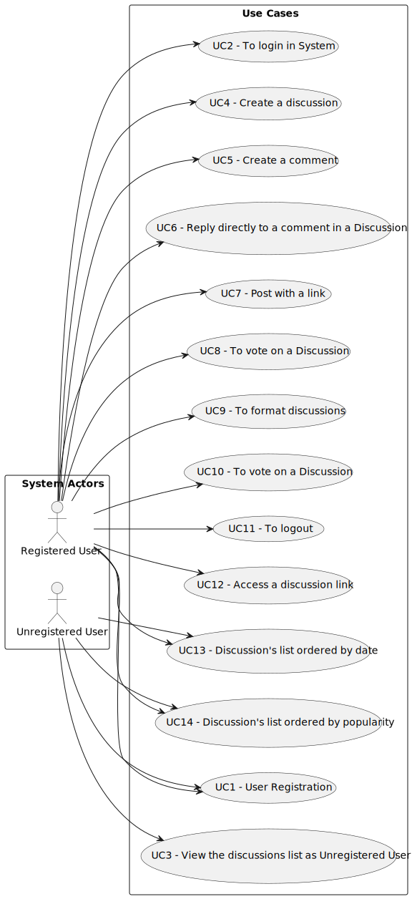

# Use Case Diagram (UCD)

**In the scope of this project, there is a direct relationship of _1 to 1_ between Use Cases (UC) and User Stories (US).**

However, be aware, this is a pedagogical simplification. On further projects and curricular units might also exist _1 to
N **and/or** N to 1 relationship between US and UC.

**Insert below the Use Case Diagram in a SVG format**

**For each UC/US, it must be provided evidences of applying main activities of the software development process (
requirements, analysis, design, tests and code). Gather those evidences on a separate file for each UC/US and set up a
link as suggested below.**

# Use Cases / User Stories

| UC/US  | Description                                   |                   
|:-------|:----------------------------------------------|
| US 001 | [User Registration](../../us001/Readme.md) |
| US 002 | [To login in System](../../us002/Readme.md) |                       |
| US 003 | [View the discussions list as Unregistered User ](../../us003/Readme.md)          |
| US 004 | [Create a discussion](../../us004/Readme.md)          |
| US 005 | [Create a comment](../../us005/Readme.md)          |
| US 006 | [Reply directly to a comment in a Discussion](../../us006/Readme.md)          |
| US 007 | [Post with a link](../../us007/readme.md)          |
| US 008 | [To vote on a Discussion](../../us008/readme.md)          |
| US 009 | [To format discussions](../../us009/readme.md)          |
| US 010 | [To vote on a Discussion](../../us010/readme.md)          |
| US 011 | [To logout](../../us011/readme.md)          |
| US 012 | [Access a discussion link](../../us012/readme.md)          |
| US 013 | [To be able to see the discussion's list ordered by date](../../us013/readme.md)          |
| US 014 | [To be able to see the discussion's list sorted by popularity](../../us014/readme.md)          |