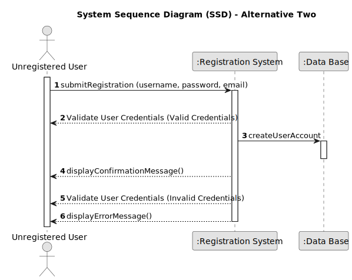

# US 001 - User Registration 

## 1. Requirements Engineering

### 1.1. User Story Description

As an unregistered user, I want to register on the application.

### 1.2. Customer Specifications and Clarifications 

**From the specifications document:**

>	The registration form includes mandatory fields: username (unique), password (minimum length), and valid email address.

>	Upon successful registration, users will receive a confirmation message and then be redirected to a specific page.

>	The registration process will provide informative error messages for failed attempts, such as "Yeahhhhh, want to try that again with a valid email?" or "Yeahhhhh, ypur password should be at least 6 chars."

**From the client clarifications:**

> **Question:** What specific information is required to register (username, password, email, etc.)?
>  
> **Answer:** Registration requires a username, a password and a valid email.

> **Question:** Are there any minimum character lengths for password?
>  
> **Answer:** The password should be at least 6 characters.

### 1.3. Acceptance Criteria

* **AC1:** The system should provide a registration form for new users.
This form should capture essential information for user accounts, such as email address, username and password. The form should enforce password complexity requirements. In this case, the password must have a minimum length.
* **AC2:** The system should validate the user-provided information during registration. This includes validating the email address format (e.g., presence of "@" and "."). The system should check for duplicate email addresses to ensure uniqueness.
* **AC3:** Upon successful registration, the system should create a new user account. The account should be associated with the provided email address and password.
* **AC4:** The system should provide feedback to the user after registration. A success/insucess message would be displayed on the screen. 

### 1.4. Found out Dependencies

* This user story is considered independent because the registration process is completely separate from other functionalities. The user wouldn't need to have an account or be logged in to access the registration page.

### 1.5 Input and Output Data

**Input Data:**

* Typed data:
	* an username, 
	* a password, 
	* an email address.
		

**Output Data:**

* (In)Success of the registration
* Creating (or not) the user's account

### 1.6. System Sequence Diagram (SSD)

**Other alternatives might exist.**

#### Alternative One

#### Alternative Two

### 1.7 Other Relevant Remarks

* To ensure a secure registration process and prevent fraudulent accounts, robust validation, spam prevention, brute-force protection, and potential account verification should be implemented.

* For a smooth user experience, the registration process should be a concise and intuitive form with clear instructions, real-time validation, informative feedback, and a user-friendly interface that seamlessly integrates with external systems if applicable.

* Several open issues remain regarding user registration, including data validation rules, email sending mechanisms, error handling, personalization options, and compliance with data privacy regulations.
