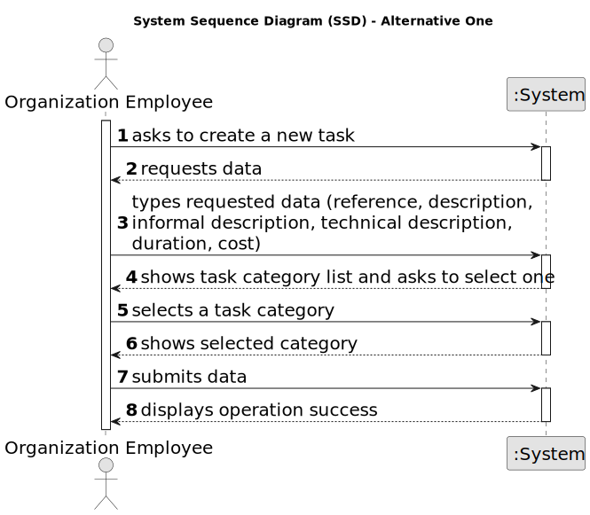
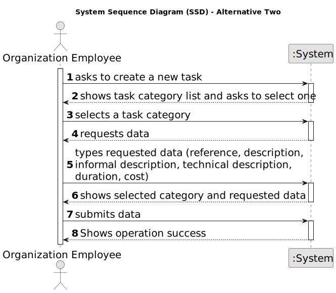

# US 001 - User Registration 

## 1. Requirements Engineering

### 1.1. User Story Description

As an unregistered user, I want to register on the application.

### 1.2. Customer Specifications and Clarifications 

**From the specifications document:**

>	Each task is characterized by having a unique reference per organization, a designation, an informal and a technical description, an estimated duration and cost as well as the its classifying task category. 

>	As long as it is not published, access to the task is exclusive to the employees of the respective organization. 

**From the client clarifications:**

> **Question:** Which is the unit of measurement used to estimate duration?
>  
> **Answer:** Duration is estimated in days.

> **Question:** Monetary data is expressed in any particular currency?
>  
> **Answer:** Monetary data (e.g. estimated cost of a task) is indicated in POTs (virtual currency internal to the platform).

### 1.3. Acceptance Criteria

* **AC1:** The system should provide a registration form for new users.
This form should capture essential information for user accounts, such as email address, username and password. The form should enforce password complexity requirements. In this case, the password must have a minimum length.
* **AC2:** The system should validate the user-provided information during registration. This includes validating the email address format (e.g., presence of "@" and "."). The system should check for duplicate email addresses to ensure uniqueness.
* **AC3:** Upon successful registration, the system should create a new user account. The account should be associated with the provided email address and password.
* **AC4:** The system should provide feedback to the user after registration. A success/insucess message would be displayed on the screen. 
* **AC5:** After successful registration, the user should be able to log in to the application using their credentials (email and password).

### 1.4. Found out Dependencies

* This user story is considered independent because the registration process is completely separate from other functionalities. The user wouldn't need to have an account or be logged in to access the registration page.

### 1.5 Input and Output Data

**Input Data:**

* Typed data:
	* a reference, 
	* a designation, 
	* an informal description
	* a technical description
	* an estimated duration
	* an estimated cost
	
* Selected data:
	* Classifying task category 

**Output Data:**

* List of existing task categories
* (In)Success of the operation

### 1.6. System Sequence Diagram (SSD)

**Other alternatives might exist.**

#### Alternative One

#### Alternative Two

### 1.7 Other Relevant Remarks

* The created task stays in a "not published" state in order to distinguish from "published" tasks.