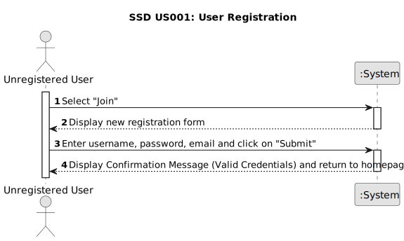

# US 001 - User Registration 

## 1. Requirements Engineering

### 1.1. User Story Description

As an unregistered user, I want to register on the application.

### 1.2. Customer Specifications and Clarifications 

**From the specifications document:**

> There's no customer specifications about document.

**From the client clarifications:**

> There's no client clarifications about this project.

### 1.3. Acceptance Criteria

* **AC1:** The system should provide a registration form for new users.
* **AC2:** The system should validate the user-provided information during registration. 
* **AC3:** Upon successful registration, the system should create a new user account. 
* **AC4:** The system should provide feedback to the user after registration. 

### 1.4. Found out Dependencies

* This user story is considered independent because the registration process is completely separate from other functionalities. The user wouldn't need to have an account or be logged in to access the registration page.

### 1.5 Input and Output Data

**Input Data:**

* Typed data:
	* an username, 
	* a password, 
	* an email address.
		

**Output Data:**

* (In)Success of the registration
* Creating (or not) the user's account

### 1.6. System Sequence Diagram (SSD)

### 1.7 Other Relevant Remarks

* To ensure a secure registration process and prevent fraudulent accounts, robust validation, spam prevention, brute-force protection, and potential account verification should be implemented.

* For a smooth user experience, the registration process should be a concise and intuitive form with clear instructions, real-time validation, informative feedback, and a user-friendly interface that seamlessly integrates with external systems if applicable.

* Several open issues remain regarding user registration, including data validation rules, email sending mechanisms, error handling, personalization options, and compliance with data privacy regulations.
