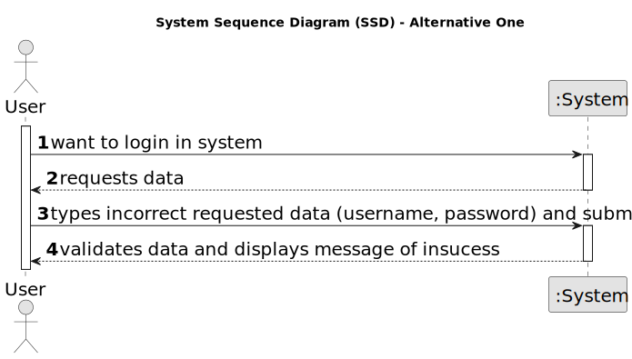
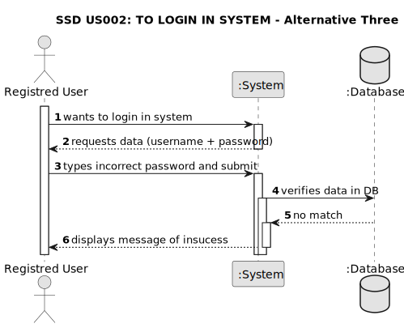

# US 002 - To login in System

## 1. Requirements Engineering

### 1.1. User Story Description

As a user I want/need to login in system.

### 1.2. Customer Specifications and Clarifications 

**From the specifications document:**

>	There's no customer specifications about document.

**From the client clarifications:**

> There's no client clarifications about this project.

### 1.3. Acceptance Criteria

* **AC1:** The user should type their username and password.
* **AC2:** The sistem must validate username and password and present a message with the outcome 
	If the result is positive, the sistem present a message of success. 
	If result negative, the sistem present a message of insucess and user must type username and password again.

### 1.4. Found out Dependencies

* There is a dependency to "US001 xxxx" due to the user must be registred to be able to login in System.

### 1.5 Input and Output Data

**Input Data:**

* Typed data:
	* an username 
	* a password
	
* Selected data:
	* Classifying task category ??????

**Output Data:**

* (In)Success of the operation

### 1.6. System Sequence Diagram (SSD)

#### Alternative One

#### Alternative Two

#### Alternative Three

### 1.7 Other Relevant Remarks

* The created task stays in a "not published" state in order to distinguish from "published" tasks. ????
If operation is unsucessful