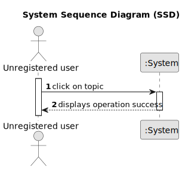

# US 003 - Access to topics from unregistered users

## 1. Requirements Engineering

### 1.1. User Story Description

* As an unregister user, I want to have access to a post so that I can read the comments.

### 1.2. Customer Specifications and Clarifications 

**From the specifications document:**

 > There's no customer specifications about document.

 **From the client clarifications:**

> There's no client clarifications about this project.

### 1.3. Acceptance Criteria

* **AC1:** Unregistered user should be granted all access to view existing posts.

### 1.4. Found out Dependencies

* There is no dependencies

### 1.5 Input and Output Data

**Input Data:**

* No imput data needed

**Output Data:**

* No output data needed
### 1.6. System Sequence Diagram (SSD)

### 1.7 Other Relevant Remarks

* There are no relevant remarks.