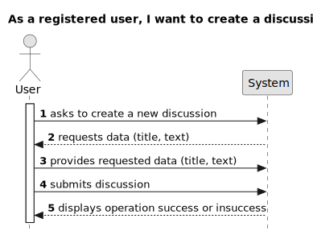

# US 004 - Create a discussion 

## 1. Requirements Engineering

### 1.1. User Story Description

As a registered user, I want to create a discussion.

### 1.2. Customer Specifications and Clarifications 

**From the specifications document:**

>	There's no customer specifications about document.

**From the client clarifications:**

>  There's no client clarifications about this project.

### 1.3. Acceptance Criteria

* **AC1:** Submit button to create discussion.
* **AC2:** All required fiels must be filled in.
* **AC3:** Title must have beetween 2 and 85 characters.
* **AC4:** Text post should be 20 to 10000 characters.
* **AC5:** Must Click on button submit post.

### 1.4. Found out Dependencies

* There is a dependency to "US001 As an unregistered user, I want to register on the application (join)" as being registered is a requirement for this task.

* There is a dependency to "US002 As a user I want/need to login in sistem" since i need to login to make a discussion.

### 1.5 Input and Output Data

**Input Data:**

* Typed data:
	* title
	* text

	
* Selected data:
	* Classifying task category 

**Output Data:**

* Message of Success operation

### 1.6. System Sequence Diagram (SSD)

**Other alternatives might exist.**

#### Alternative One

### 1.7 Other Relevant Remarks

* The created discussion initially stays in a "not published" state to distinguish it from "published" discussions.
* Users must be logged in to create a discussion, ensuring that only registered and authenticated users can post content.
* The system should ensure data integrity by validating the input fields before saving the discussion to the database.
* In case of a failure, the system should allow the user to correct the errors and resubmit the discussion.
* The system should have appropriate logging and error handling mechanisms to track any issues during the discussion creation process.
