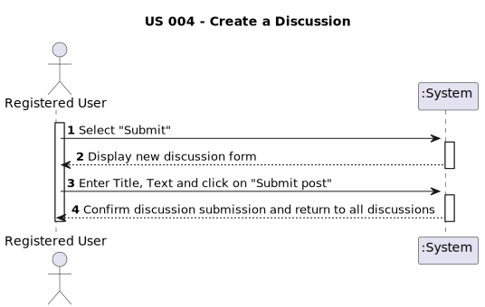

# US 004 - Create a discussion 

## 1. Requirements Engineering

### 1.1. User Story Description

As a registered user, I want to create a discussion.

### 1.2. Customer Specifications and Clarifications 

**From the specifications document:**

>	There's no customer specifications about document.

**From the client clarifications:**

>  There's no client clarifications about this project.

### 1.3. Acceptance Criteria

* **AC1:** All required fiels must be filled in.
* **AC2:** Title must have beetween 2 and 85 characters.
* **AC3:** Text post should be 20 to 10000 characters.

### 1.4. Found out Dependencies

* There is a dependency to "US001 - User Registration" as being registered is a requirement for this task.

* There is a dependency to "US002 - To login in System" since i need to login to make a discussion.

### 1.5 Input and Output Data

**Input Data:**

* Typed data:
	* Title
	* Text

**Output Data:**

* Confirmation of successful post submission
* Error messages in case of failure

### 1.6. System Sequence Diagram (SSD)

### 1.7 Other Relevant Remarks

* The system should ensure data integrity by validating the input fields before saving the discussion to the database.
* Spaces in the fields shoul not be counted as characters, because it contradicts the acceptance criteria of the system.
* Clicking on enter in text shold not count as a character, because it contradicts the acceptance criteria of the system.
* In case of a failure, the system should allow the user to correct the errors and resubmit the discussion.
* Error messages should be clear, concise, and professional. 
