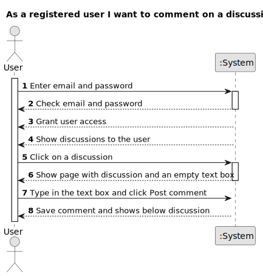

# US 005 - Create a comment

## 1. Requirements Engineering

### 1.1. User Story Description

As a registered user I want to comment on a discussion.

### 1.2. Customer Specifications and Clarifications

**From the specifications document:**

>     There's no customer specifications about document.

**From the client clarifications:**

> There's no client clarifications about this project.

### 1.3. Acceptance Criteria

**AC1:** The user must enter email and password to log in.

**AC2:** The system must check whether the email and password are correct.

**AC3:** If the email and password are correct, the system should grant access to the user.

**AC4:** If the email and/or password are incorrect, the system should display an error message.

**AC5:** Once the user is logged in, they should view the discussions posted on the application.

**AC6:** When the user clicked on a discussion. The system must display an empty text box to enter a comment. /

**AC7:** When the user types a comment in the text box, the minimum text length must be 20 characters and a maximum of 10.000.

**AC8:** If the user types less than 20 characters in the text box, the system should display an error message indicating the number of characters allowed.

**AC9:** After the user types the comment, they must click on the "Post comment" button. The system should save the comment and a success message should be displayed.

**AC10:** If the user tries to send an empty comment, the system should display an error message indicating that the comment cannot be empty.

**AC11:** When a new comment is added to the same topic, it should be displayed in chronological order from oldest to newest with the date of its post next to it.

### 1.4. Found out Dependencies

- US001
- US002
- US004

- There is a dependency on US001 'Application registration', as the user needs to be registered in the application.

- There is a dependency on US002 'Log in', as the user needs to be logged in to the application.

- There is a dependency on US004 'Create a discussion', as discussions need to exist to be commented on.

### 1.5 Input and Output Data

**Input Data:**

- Typed data:

  - Email
  - Password
  - Discussion
  - Comment text

- Selected data:
  - Classifying task category ??????

**Output Data:**

- System informs a success message confirming the posting of the comment.

- The discussion is updated with the date and time of the comment. (timestamp).

### 1.6. System Sequence Diagram (SSD)

**Other alternatives might exist.**

#### Alternative One

#### Alternative Two

### 1.7 Other Relevant Remarks

- We can implement a notification system to alert users to new comments in discussions they are involved in. This can be done through push notifications, emails, or notification icons in the user interface.

- We can allow users to edit or delete their own comments after posting. This will give users more control over their content and help them correct errors or update information.
