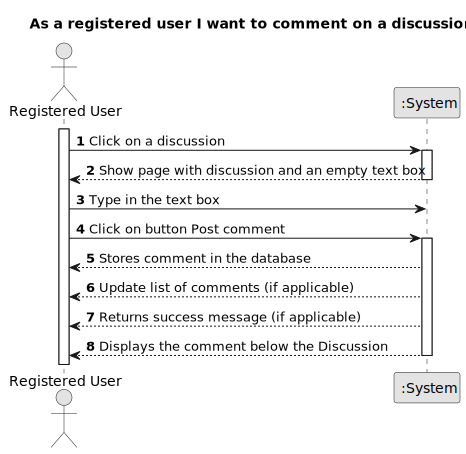

# US 005 - Create a comment

## 1. Requirements Engineering

### 1.1. User Story Description

As a registered user I want to comment on a discussion.

### 1.2. Customer Specifications and Clarifications

**From the specifications document:**

>     Each task is characterized by having a unique reference per organization, a designation, an informal and a technical description, an estimated duration and cost as well as the its classifying task category.

>     As long as it is not published, access to the task is exclusive to the employees of the respective organization.

**From the client clarifications:**

> **Question:** Which is the unit of measurement used to estimate duration?
>
> **Answer:** Duration is estimated in days.

> **Question:** Monetary data is expressed in any particular currency?
>
> **Answer:** Monetary data (e.g. estimated cost of a task) is indicated in POTs (virtual currency internal to the platform).

### 1.3. Acceptance Criteria

**AC1:** The user must enter email and password to log in.

**AC2:** The system must check whether the email and password are correct.

**AC3:** If the email and password are correct, the system should grant access to the user.

**AC4:** If the email and/or password are incorrect, the system should display an error message.

**AC5:** Once the user is logged in, they should view the discussions posted on the forum.

**AC6:** When the user clicked on a discussion. The system must display an empty text box to enter a comment. /

**AC7:** When the user types a comment in the text box, the minimum text length must be 20 characters and a maximum of 10.000.

**AC8:** If the user types less than 20 characters in the text box, the system should display an error message indicating the number of characters allowed.

**AC9:** After the user types the comment, they must click on the "Post comment" button, the comment must be saved and displayed below the discussion.

**AC10:** If the user tries to send an empty comment, the system should display an error message indicating that the comment cannot be empty.

**AC11:** When a new comment is added to the same thread, it should be displayed in chronological order from oldest to newest.

### 1.4. Found out Dependencies

- US001
- US002
- US004

- Existe uma dependência da US001 'Registro na aplicação', pois o usuário precisa estar registrado na aplicação. / There is a dependency on US001 'Application registration', as the user needs to be registered in the application.

- Existe uma dependência da US002 'Fazer login', pois o usuário precisa estar logado na aplicação./ There is a dependency on US002 'Log in', as the user needs to be logged in to the application.

- Existe uma dependência da US004 'Criar uma discussion', pois discussions precisam existir para serem comentadas./ There is a dependency on US004 'Create a discussion', as discussions need to exist to be commented on.

### 1.5 Input and Output Data

**Input Data:**

- Typed data:

  - Email
  - Password
  - Discussion
  - Comment text

- Selected data:
  - Classifying task category ??????

**Output Data:**

- System informs a success message confirming the posting of the comment.

- The discussion is updated with the date and time of the comment. (timestamp).

### 1.6. System Sequence Diagram (SSD)

**Other alternatives might exist.**

#### Alternative One

#### Alternative Two

### 1.7 Other Relevant Remarks

Implementing functionality that allows the user to edit a comment they have posted can improve the user experience.

Implementing a functionality that allows the user to delete a comment they posted can improve the user experience.
