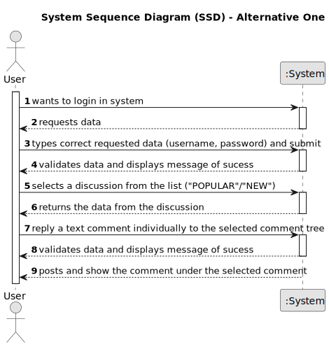

# US 006 - To create a Task 

## 1. Requirements Engineering

### 1.1. User Story Description

As a user, i want to reply to a comment to take part in the discussion.
	

### 1.2. Customer Specifications and Clarifications 

**From the specifications document:**

>	Each task is characterized by having a unique reference per organization, a designation, an informal and a technical description, an estimated duration and cost as well as the its classifying task category.

>	As long as it is not published, access to the task is exclusive to the employees of the respective organization. 

**From the client clarifications:**

> **Question:** Which is the unit of measurement used to estimate duration?
>  
> **Answer:** Duration is estimated in days.

> **Question:** Monetary data is expressed in any particular currency?
>  
> **Answer:** Monetary data (e.g. estimated cost of a task) is indicated in POTs (virtual currency internal to the platform).

### 1.3. Acceptance Criteria

* **AC1:** The user must be logged in.  
* **AC2:** There must be an open discussion posted.
* **AC3:** The text box must have the minimum number of characters present: 
	. If so, the system accepts and displays a success message (pop-up) and publishes the comment. 
	. If not, the system prompts the user (pop-up) to enter a minimum of X characters and does not publish the comment.

### 1.4. Found out Dependencies

* There is a dependency to "us001" and "us002" since we have the need to be registered and logged in.

### 1.5 Input and Output Data

**Input Data:**

* Typed data:
	* username, 
	* password, 
	* comment text
	
	
* Selected data:
	* Classifying task category 

**Output Data:**

* List of existing task categories
* (In)Success of the operation

### 1.6. System Sequence Diagram (SSD)

**Other alternatives might exist.**

#### Alternative One

#### Alternative Two

### 1.7 Other Relevant Remarks

* The created task stays in a "not published" state in order to distinguish from "published" tasks.