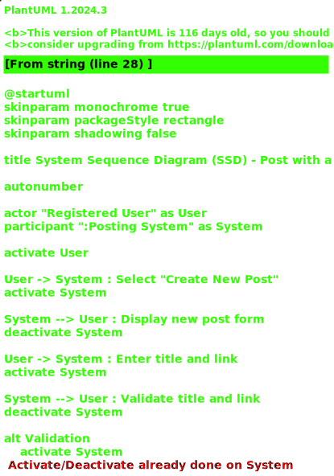

# US 007 - Create link post 

## 1. Requirements Engineering

### 1.1. User Story Description

As a registered user, I want to submit a new post with a link so that I can share content with the community.

### 1.2. Customer Specifications and Clarifications 

**From the specifications document:**

>	Each post must have a title and a valid URL.

**From the client clarifications:**

> **Question:** Are there any restrictions on the types of links that can be submitted?
>  
> **Answer:** There are no restrictions on the types of links that can be submitted, as long as they are valid URLs starting with HTTP, HTTPS, or FTP.

### 1.3. Acceptance Criteria

* **AC1:** All required fields (title and link) must be filled in.
* **AC2:** The title must have a minimum of 2 characters and a maximum of 85 characters. If the title length is invalid, the system must reject the submission and present a message of failure.
* **AC3:** The link must have a minimum of 8 characters and a maximum of 500 characters. If the link length is invalid, the system must reject the submission and present a message of failure.
* **AC3:** The link must be a valid URL starting with HTTP, HTTPS, or FTP. If the link url is invalid, the system must reject the submission and present a message of insucess.

### 1.4. Found out Dependencies

* There is a dependency on "US001 User Registration" since only registered users can submit posts.
* There is a dependency on "US002 To login in System" since only logged users can submit posts.

### 1.5 Input and Output Data

**Input Data:**

* Typed data:
	* Title 
	* Link 
	
* Selected data:
	* Classifying task category 

**Output Data:**

* Confirmation of successful post submission
* Error messages in case of validation failures

### 1.6. System Sequence Diagram (SSD)

#### Alternative One

### 1.7 Other Relevant Remarks

* The submitted post must be immediately visible to all users if it passes validation.
* Implementing a preview feature before final submission could enhance user experience.
* The current system accepts HTTP, HTTPS, and FTP links without validating them. Future updates may include proper URL validation to enhance security and usability.
* Error messages should be clear, concise, and professional. For example, instead of "Yeahhhhh, link posts should be 8 to 500 characters. Yours was 0," a more professional message would be: "Error: The link must be between 8 and 500 characters. Please enter a valid link."