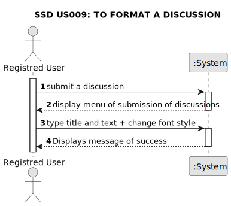

# US 009 - To format a discussion

## 1. Requirements Engineering

### 1.1. User Story Description

As a user, I want to be able to display font layout (bold, italic, underline) or add an link in dicussions.

### 1.2. Customer Specifications and Clarifications 

**From the specifications document:**

>	There's no customer specifications about document.

**From the client clarifications:**

> There's no client clarifications about this project.

### 1.3. Acceptance Criteria

* **AC1:** User must be logged-in.
* **AC2:** After user writes a text in a discution, can use the bold format.
* **AC3:** 

### 1.4. Found out Dependencies

* There is a dependency to "US002 To Login in System" once user must be already registred to be able to post a discussion.
* There is a dependency to "US004 Create a discussion" because these functions are only available in discussions and they need to be 

### 1.5 Input and Output Data

**Input Data:**

* Typed data:
	* a title
	* a text
	
* Selected data:
	* Bold
	* Italic
	* Underlined
	* Link

**Output Data:**

* (In)Success of the operation

### 1.6. System Sequence Diagram (SSD)

#### Alternative One

### 1.7 Other Relevant Remarks

* The created task stays in a "not published" state in order to distinguish from "published" tasks.