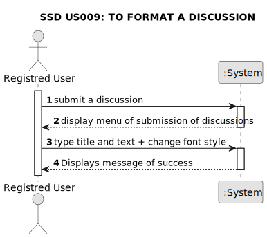

# US 009 - To format a discussion

## 1. Requirements Engineering

### 1.1. User Story Description

As a registred user, I want to be able to change font style (bold, italic, underline).

### 1.2. Customer Specifications and Clarifications 

**From the specifications document:**

>	There's no customer specifications about document.

**From the client clarifications:**

> There's no client clarifications about this project.

### 1.3. Acceptance Criteria

* **AC1:** User must be logged-in and submit a discussion.
* **AC2:** Title must be typed (mininum of 2 characters and maximum of 85). If the lenght of title is invalide, the system will present a message of error.
* **AC3:** Text must be typed (mininum of 8 characters and maxinum of 500). If the lenght of text is invalide, the system will present a message of error.
* **AC4:** If Title and Text is valid, user can change font style and then submit discussion.

### 1.4. Found out Dependencies

* There is a dependency to "US002 To Login in System" once user must be already registred to be able to post a discussion.
* There is a dependency to "US004 Create a discussion" and "US005 Create a comment" because these functions are only available in discussions and comments.

### 1.5 Input and Output Data

**Input Data:**

* Typed data:
	* a title
	* a text
	
* Selected data:
	* Bold
	* Italic
	* Underlined

**Output Data:**

* (In)Success of the operation

### 1.6. System Sequence Diagram (SSD)

### 1.7 Other Relevant Remarks

* There are no relevant remarks about this US.