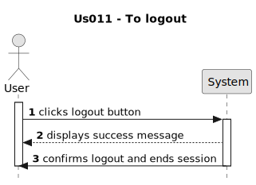

# US 006 - To create a Task 

## 1. Requirements Engineering

### 1.1. User Story Description

As a user I want to logout of the application.

### 1.2. Customer Specifications and Clarifications 

**From the specifications document:**

>	There's no customer specifications about document.

**From the client clarifications:**

> There's no client clarifications about this project.

### 1.3. Acceptance Criteria

* **AC1:** Must be login in application.
* **AC2:** Must click on button logout.

### 1.4. Found out Dependencies

*  There is a dependency to "US001 As an unregistered user, I want to register on the application (join)" as being registered who makes login, i want to logout.

* There is a dependency to "US002 As a user I want/need to login in sistem" since i need to login to make a logout wheter i am register or not.

### 1.5 Input and Output Data

**Input Data:**

* Typed data:
	* null
	

**Output Data:**

* Success of the operation

### 1.6. System Sequence Diagram (SSD)

**Other alternatives might exist.**

#### Alternative One

### 1.7 Other Relevant Remarks

* This user story is essential for ensuring user session management within the application.
* Proper logout functionality enhances security by ensuring that users can end their sessions securely.

