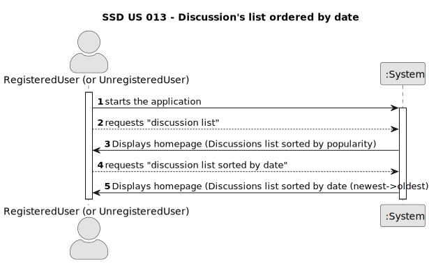

# US 013 - Discussion's list ordered by date

## 1. Requirements Engineering

### 1.1. User Story Description

As a user, i want to see all the discussion's list sorted by date.
	

### 1.2. Customer Specifications and Clarifications 

**From the specifications document:**

>None

**From the client clarifications:**

>None

### 1.3. Acceptance Criteria

* **AC1:** The system should display a list of all available discussions when the user navigates to a page containing discussions (homepage).
* **AC2:** Each discussion in the list should display key information such as the discussion title, the number of comments and creation date.
* **AC3:** The user should be able to sort the list by date (newest -> oldest).

### 1.4. Found out Dependencies

* There is a dependency to "us001" and "us002" since we have the need to be registered and logged in, allowing the user to upvote/downvote.
* There is a dependency to the Homepage content presented in "us014".

### 1.5 Input and Output Data

**Input Data:**

* Typed data:
	* null, 
	
	
	
	
* Selected data:
	* null

**Output Data:**

* (In)Success of the operation
* Discussions list sorted by date

### 1.6. System Sequence Diagram (SSD)

**Other alternatives might exist.**

#### Alternative One

#### Alternative Two

### 1.7 Other Relevant Remarks

* Unrestricted Content Access: Unregistered users can browse and view posts freely.
Restricted Actions: Upvoting and downvoting functionality is reserved for registered users.