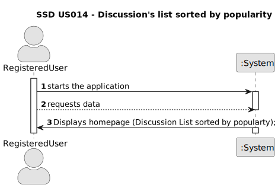
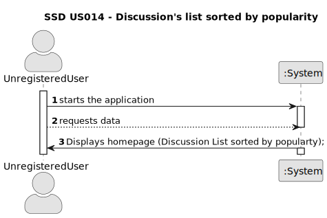

# US 014 - To be able to see the discussion's list ordered by popularity

## 1. Requirements Engineering

### 1.1. User Story Description

As a user, i want to see all the discussion's list ordered by popularity.
	

### 1.2. Customer Specifications and Clarifications 

**From the specifications document:**

>	Each task is characterized by having a unique reference per organization, a designation, an informal and a technical description, an estimated duration and cost as well as the its classifying task category.

>	As long as it is not published, access to the task is exclusive to the employees of the respective organization. 

**From the client clarifications:**

> **Question:** Which is the unit of measurement used to estimate duration?
>  
> **Answer:** Duration is estimated in days.

> **Question:** Monetary data is expressed in any particular currency?
>  
> **Answer:** Monetary data (e.g. estimated cost of a task) is indicated in POTs (virtual currency internal to the platform).

### 1.3. Acceptance Criteria

* **AC1:** The system should display a list of all available discussions when the user navigates to the discussions page.
* **AC2:** Each discussion in the list should display key information such as the discussion title, author, the number of comments creation date and upvote/downvote count.
* **AC3:** The user should be able to sort the list by popularity.

### 1.4. Found out Dependencies

* There is a dependency to "us001" and "us002" since we have the need to be registered and logged in.

### 1.5 Input and Output Data

**Input Data:**

* Typed data:
	* username, 
	* password, 
	
	
	
* Selected data:
	* Classifying task category 

**Output Data:**

* (In)Success of the operation

### 1.6. System Sequence Diagram (SSD)

**Other alternatives might exist.**

#### Alternative One

#### Alternative Two

### 1.7 Other Relevant Remarks

* Unrestricted Content Access: Unregistered users can browse and view posts freely.
Restricted Actions: Upvoting and downvoting functionality is reserved for registered users.