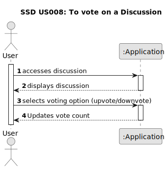

# US 008 - To vote on a Discussion

## 1. Requirements Engineering

### 1.1. User Story Description

As a user, I want to vote on a discussion created by another user.

### 1.2. Customer Specifications and Clarifications 

**From the specifications document:**

> There's no customer specifications about document.

**From the client clarifications:**

> There's no client clarifications about this project.

### 1.3. Acceptance Criteria

* **AC1:** The system must display a vote button on each discussion.
* **AC2:** The user must be able to click the vote button to cast their vote.
* **AC3:** The system must display the vote count for each discussion.
* **AC4:** The user must be able to change their vote at any time.
* **AC5:** The system must prevent the user from voting on a discussion more than once.  
* **AC6:** The user must be able to see who voted on a discussion. (additional)
* **AC7:** The system must prevent the user from voting on their own discussion. (additional)

### 1.4. Found out Dependencies

* The main dependencies of the user story "As a user, I want to vote on a discussion created by another user" are:

	* Logging in to the system (User Story 2: "As a user, I want/need to log in to the system") because users must be logged in to vote.
	* Viewing the listed discussions (User Story 13: "As a user, I want to be able to see the listed discussions") because users must be able to see the discussions to vote on them.

* Indirect dependencies include password recovery and discussion creation, which are necessary to maintain the cycle of user interaction within the forum.

### 1.5 Input and Output Data

**Input Data:**

* Typed data:
	* an email (Login) 
	* an password (Login)
	
	
* Selected data:
	* Vote Type 
	

**Output Data:**

* Updated Vote Count
* Updated User Interface

### 1.6. System Sequence Diagram (SSD)

### 1.7 Other Relevant Remarks

* Implement measures to detect and prevent fraudulent voting behavior,

* Specify how votes will be stored and managed within the system,

* Consider if there are limitations on the impact of votes (e.g., vote caps to prevent abuse).

