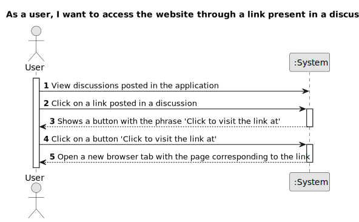

# US 0012 - Access a discussion link

## 1. Requirements Engineering

### 1.1. User Story Description

As a user, I want to access the website through a link present in a discussion.

### 1.2. Customer Specifications and Clarifications

**From the specifications document:**

>     There's no customer specifications about document.

**From the client clarifications:**

> There's no client clarifications about this project.

### 1.3. Acceptance Criteria

**AC1:** If a discussion posted to the application contains a link, that link must be displayed as a hyperlink in a different color or formatting than the rest of the text and must be clickable.

**AC2:** When the user clicks on the link, a button should be shown with the phrase 'Click to visit the link at'.

**AC3:** When the user clicks on the 'Click to visit the link in' button, a new browser tab should open with the page corresponding to the link.

**AC4:** If a discussion posted on the application contains links in different parts (start, middle, end), all links must be displayed correctly and must be clickable.

**AC5:** If a discussion posted to the application contains duplicate links, both must be displayed correctly and must be clickable.

### 1.4. Found out Dependencies

- US004
- US007

- There is a dependency on US004 'Create a discussion', as discussions need to exist to be commented on.

- There is a dependency on US007 'Post a link/hyperlink', as links need to exist to be clicked.

### 1.5 Input and Output Data

**Input Data:**

- Typed data:

  - Discussion
  - Link url

- Selected data:
  - Classifying task category ??????

**Output Data:**

- Opening the url in a new tab;

### 1.6. System Sequence Diagram (SSD)

**Other alternatives might exist.**

#### Alternative One

#### Alternative Two

### 1.7 Other Relevant Remarks

- The URL must be checked to ensure it does not lead to a malicious website to improve the user experience.
- In addition to automatically opening in a new tab, we can provide users with the option to choose whether they want to open the link in the same tab or in a new window. This will increase the flexibility and personalization of users' browsing experience.
